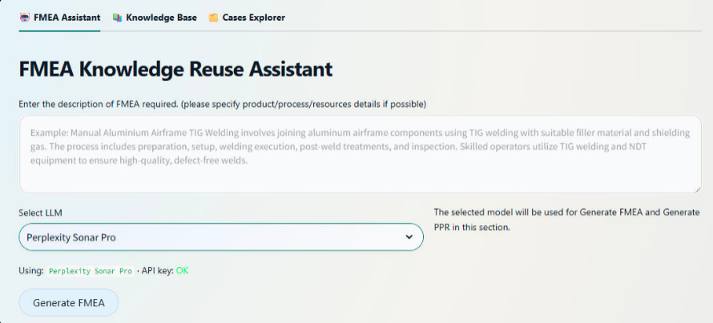
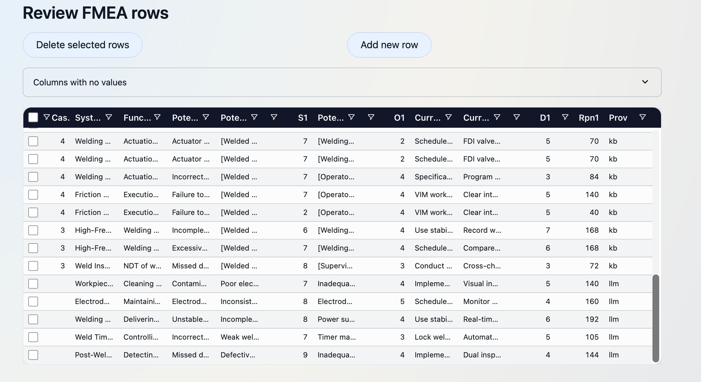

# FMEA Knowledge Reuse Assistant (CBR + RAG for Reliability Engineering)

A Streamlit web app (Master’s thesis, OvGU) that helps engineers **reuse and extend historical welding FMEAs** using Case‑Based Reasoning (CBR) and Retrieval‑Augmented Generation (RAG), backed by a Supabase (PostgreSQL + pgvector) semantic knowledge base. Experts stay in control: the LLM proposes, engineers review and approve.

**Live app:** [fmea-app-validation.streamlit.app](https://fmea-app-validation.streamlit.app/)  
**Portfolio:** [ranjith-mahesh.netlify.app](https://ranjith-mahesh.netlify.app/#projects)  
**Research:** *Leveraging LLMs and Case-Based Reasoning for Expert-Governed Risk Knowledge Reuse* – D. Hoffmann, R. Mahesh, S. K. Raju, A. Lüder. Presented at IEEE ETFA 2026; to appear in IEEE Xplore.  
**Dataset:** [fmea-knowledge-reuse-dataset](https://github.com/ranjith-24-prog/fmea-knowledge-reuse-dataset)  
**University/Thesis:** Otto von Guericke University (OvGU) — Master’s Thesis

## Key results

- **Retrieval is the main quality driver:** with RAG, FMEA completeness rose for all five LLMs, e.g. Gemini 2.0 Flash from 2.33 to 4.67 out of 5.
- **Best configuration:** mean expert rating of **4.46/5** (Claude Sonnet 4.5, 20 retrieved rows, zero-shot prompting).
- **Cost-efficient models compete when grounded:** Gemini 2.0 Flash reached 4.33/5 at about $0.0011 per run, roughly 50× cheaper than the best model.
- **150 configurations** evaluated across 5 LLMs, 5 retrieval densities, 3 prompting strategies, and RAG vs. no-RAG baselines, rated by a panel of 8 subject-matter experts.

## Why this project
FMEA is powerful but repetitive: teams often recreate similar risk analyses for new product variants or process changes, even when past FMEAs contain reusable knowledge.

This project focuses on:
- Converting historical FMEAs into a **living case base** that engineers can search and adapt.
- Grounding LLM suggestions in retrieved real cases (RAG) to reduce irrelevant or unsafe outputs.
- Keeping experts in control via Human‑in‑the‑Loop review and approval.

## What it does (3 pages)
### 1) FMEA Assistant
- Enter a welding step / process element description in natural language.
- Retrieve semantically similar historical cases from the case base (vector search).
- Use retrieved cases as context for an LLM to draft FMEA rows (failure modes, causes, effects, actions) and optional PPR (Products, Process, and Resources details).
- Every row carries a provenance tag: `kb` (retrieved knowledge), `llm` (generated proposal) or `manual` (expert-written or revised).
- Review/edit everything in an interactive table, adjust Severity, Occurrence and Detection ratings, then save as a new/updated case or export for import into APIS IQ.

### 2) Knowledge Base (APIS IQ import)
- Upload FMEAs Excel files generated using APIS IQ tool.
- Store raw files in Supabase Storage and parse them into a structured FMEA schema.
- Create embeddings for rows/cases to enable meaning-based retrieval (semantic search).

### 3) Cases Explorer
- Browse, filter, and inspect stored cases and FMEA rows.
- Maintain the case base and capture expert-validated updates (closing the CBR loop).

## Quick start (use the hosted app)
1. Open the app: https://fmea-app-validation.streamlit.app/
2. Choose a page based on your task (FMEA Assistant / Knowledge Base / Cases Explorer).
3. Generate suggestions, edit/approve them, and save back into the knowledge base.
4. Reuse saved cases as context for future FMEAs.

## Example prompt
> Create process level FMEA rows for an Automated resistance spot welding process on automotive body parts. Focus on a maximum of 5 critical failure modes, including causes, effects, and recommended actions.

Output

## How it works (CBR + two-phase RAG + Human-in-the-Loop)
- **Retrieve, phase 1 (cases):** the three most similar manufacturing cases are selected by their Product, Process and Resource context, so retrieval stays within comparable engineering situations.
- **Retrieve, phase 2 (rows):** within those cases, individual FMEA rows are ranked by cosine similarity; the top‑k rows become the LLM's context.
- **Generate:** the LLM drafts FMEA rows and PPR suggestions grounded in the retrieved cases.
- **Verify (HIL):** engineers review, edit, reject or approve every entry; the Risk Priority Number is recalculated when ratings change.
- **Retain:** only expert-approved entries are written back to the case base, so the knowledge base grows without unvalidated model output.
- **Iterate (CRISP‑DM):** Business understanding → data understanding → preparation → modeling → evaluation → deployment.  
  Reference CRISP-DM phases: https://start.agilytic.com/crisp-dm

## Evaluation

Setup, results table and findings (click to expand)

**Setup.** Ten welding FMEA cases derived from the literature (TIG, MIG, spot, friction, ultrasonic and hairpin welding). Seven formed the case base; three deliberately different cases were held out as test tasks: manual aluminium airframe TIG welding, robotic spot welding of a steel car chassis, and automated ultrasonic welding of plastic.

**Configurations.** 150 in total: 5 LLMs (Claude Sonnet 4.5, GPT‑4o, Gemini 2.0 Flash, Mistral Large, Perplexity Sonar Pro) × 5 retrieval densities (k = 5, 10, 20, 30, 50) × 3 prompting strategies (zero-, one-, few-shot), plus no-RAG baselines.

**Metrics.** Latency, token usage and estimated cost per run; output quality rated by an independent panel of 8 subject-matter experts on a 5-point scale across 8 criteria (failure modes, causes, effects, SOD ratings, technical realism, completeness and more).

**FMEA completeness with and without RAG (out of 5)**

| Model | Without RAG | With RAG |
| --- | --- | --- |
| Claude Sonnet 4.5 | 3.67 | 4.00 |
| GPT‑4o | 2.33 | 4.00 |
| Gemini 2.0 Flash | 2.33 | 4.67 |
| Mistral Large | 3.00 | 4.33 |
| Perplexity Sonar Pro | 3.00 | 4.33 |

**Findings**
- **More context is not always better:** k = 20 performed best; at k = 50 the mean rating fell to 3.62 because unrelated cases leaked in (e.g. gas porosity from manual TIG welding appearing for ultrasonic plastic welding).
- **Prompting mattered little:** zero-, one- and few-shot prompting gave similar results once retrieval supplied the context.
- **Quality vs. cost:** Claude Sonnet 4.5 scored highest (4.46/5) but was slowest and most expensive (34.94 s, about $0.054 per run); Gemini 2.0 Flash scored 4.33/5 in 10.31 s at about $0.0011 per run.

**Limitations.** The case base is small and literature-derived, so it is more consistent than real industrial FMEA data. The expert panel was small. Review effort, decision time and trust were not measured.

## Output
- Draft FMEA rows (failure mode, cause, effect, recommended action) suitable for expert review.
- Optional PPR (Product, Process and Resource) details aligned with a PPR ontology.
- A growing, semantically searchable case base that improves as validated cases are added.

## Tech stack
- Python (ETL/parsing, retrieval + generation orchestration, evaluation scripts)
- Streamlit (multi-page app; interactive tables for human-in-the-loop editing)
- RAG + CBR patterns (retrieve similar cases → generate grounded drafts → store validated improvements)
- Embeddings: Sentence-Transformers `all-MiniLM-L6-v2` (384-dimensional vectors)  
  Reference (STS usage/docs): https://sbert.net/docs/sentence_transformer/usage/semantic_textual_similarity.html
- Similarity search: cosine similarity; nearest-neighbor retrieval in Postgres via pgvector with an HNSW index  
  Reference: https://supabase.com/docs/guides/ai/semantic-search
- Model-agnostic LLM routing (Claude, GPT, Gemini, Mistral, Perplexity)
- Supabase backend:
  - PostgreSQL (FMEA schema: cases, rows, PPR entities)
  - pgvector (embedding storage + similarity operators)
  - Supabase Storage (raw APIS IQ Excel uploads)

## Notes / limitations
- Outputs must be reviewed by qualified engineers (safety-critical domain).
- Retrieval quality depends on the coverage and cleanliness of the imported case base.
- LLMs can still make mistakes; grounding + constraints reduce risk, but do not eliminate it.

## Acknowledgment
Research conducted at the Institute for Engineering of Products and Systems, Otto von Guericke University Magdeburg, with support from the state of Saxony-Anhalt and the European Regional Development Fund (EFRE).
